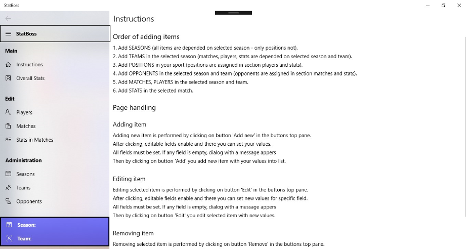
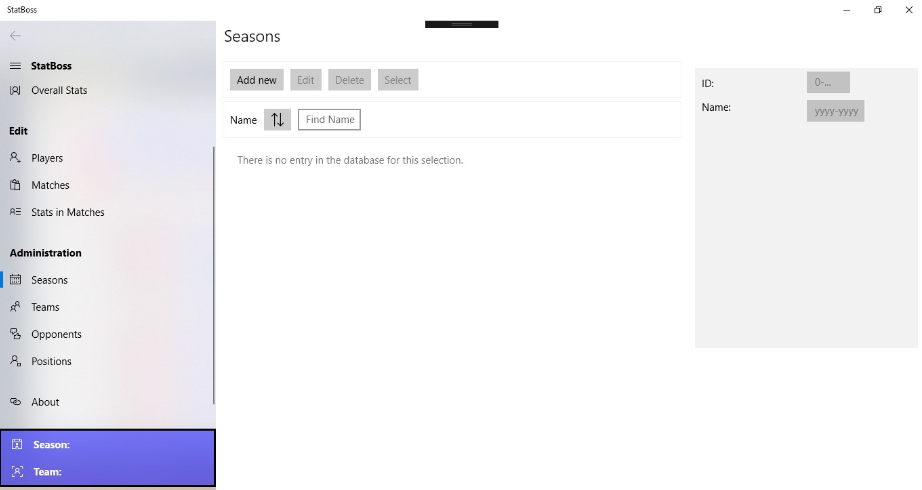
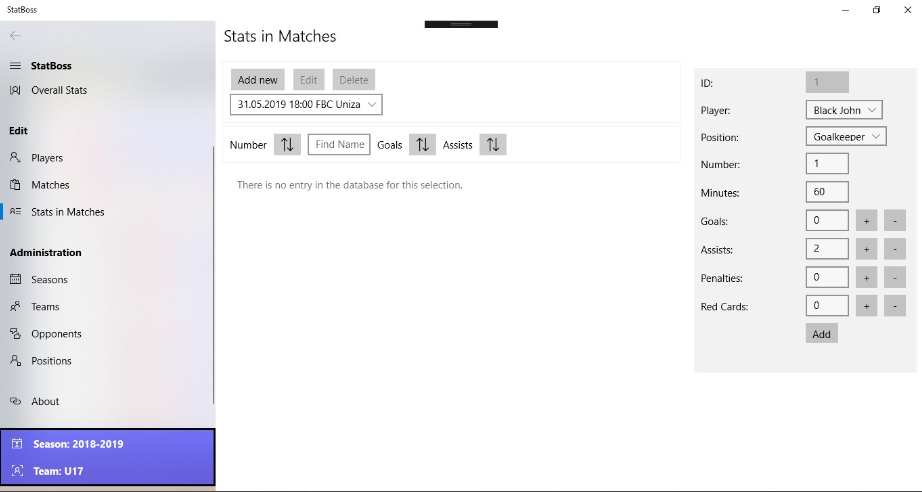

# StatBoss - UWP App

Welcome to StatBoss, your ultimate companion for managing sports statistics in a User-Interface friendly Windows app. With StatBoss, you can efficiently handle seasons, teams, players, and matches and track player statistics seamlessly.

## Features

1. Manage Seasons

- Organize and keep track of multiple seasons effortlessly.
- View, add, and edit details for each season, ensuring a structured approach to your sports data.

2. Teams Management

- Create and manage teams participating in each season.
- Assign players to teams for detailed player statistics tracking.

3. Players Database

- Maintain a comprehensive database of players.
- Track player information, including name, position, and other relevant details.

4. Match Details

- Log match information for each team within a season.
- Record match outcomes, dates, and opponents.

5. Player Stats Tracker

- Effortlessly track player statistics such as goals, assists, penalty minutes, and minutes played.
- Update player stats after each match for a detailed performance overview.

6. Main Page Overview

- Get a quick summary of the latest player stats on the main page.
- Monitor team and player performance at a glance.

## Database

StatBoss uses SQLite as the database to store and manage sports data efficiently. The use of SQLite ensures reliability and scalability for handling large datasets associated with sports seasons, teams, and player statistics.

## Supported Sports

StatBoss caters to a variety of sports, with a primary focus on:

- Hockey
- Hockeyball
- Floorball

The app is flexible and can be customized to support similar sports with ease.

## Installation

1. Clone the Repository:
```git clone https://github.com/yourusername/statboss-uwp.git```

2. Navigate to the Project Directory:
```cd statboss-uwp```

3. Build and Run:
Open the project in Visual Studio and build/run the UWP app.

4. Explore StatBoss:
Once the app is running, explore the features and functionalities to manage your sports statistics effectively.

## Technologies Used

- UWP (Universal Windows Platform): A platform provided by Microsoft that allows apps to be developed for Windows 10.
- SQLite: A lightweight and efficient database management system used for storing and retrieving sports data.

## Screenshots







## License

StatBoss is released under the MIT license. See the [LICENSE](LICENSE) file for details.
